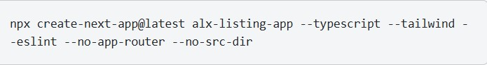
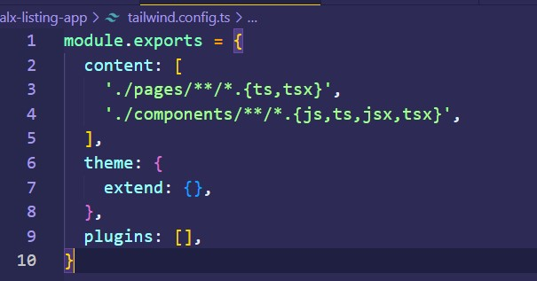
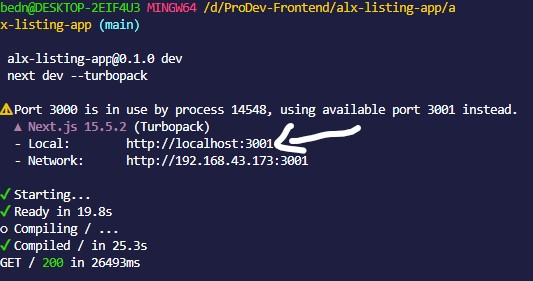

# ALX LISTING APP
The ALX Listing App project aims to scaffold and lay the foundational structure for a modern Airbnb clone. The project focuses on setting up a well-organized and scalable codebase using Next.js, TypeScript, TailwindCSS, and ESLint. By establishing a clean folder structure, reusable components, and adhering to best practices, the project ensures a solid starting point for building a dynamic, responsive, and user-friendly property listing page.

# Folder structure
- __components/__:This folder will contain all reusable components like Cards, Buttons that will be used across the project to display information.
- __constants/__:This folder set up constants to store any reusable data or strings such as API URLs, configuration settings, or UI text
- __interface/__:This folder defines all TypeScript interfaces related to the project.
- __pages/__:The pages that will be rendered to the user.
- __public/assests__:This folder keep the necessary images and SVG files that will be used across the project.
# To set up the project
1. Open up your favourite terminal and _cd_ to the project folder;

Enter the the follow commands in your terminal and press ENTER
2. Create tailwind.config.js file at the root of the project with the below content inside.

3. Import tailwind components, base and utility inside your __styles/global.css files__

4. Start your server with the command **npm run dev** in your terminal.

You should have the same output above. Press **CTRL** key and click on where the arrow in the image is pointing to open your project in the browser.

# Read more on how Install Tailwind CSS with Next.js
- [Tailwindcss-documentaion](https://tailwindcss.com/docs/installation/framework-guides/nextjs) 
- [NEXTjs-documentation](https://nextjs.org/docs?utm_source=create-next-app&utm_medium=default-template-tw&utm_campaign=create-next-app)

